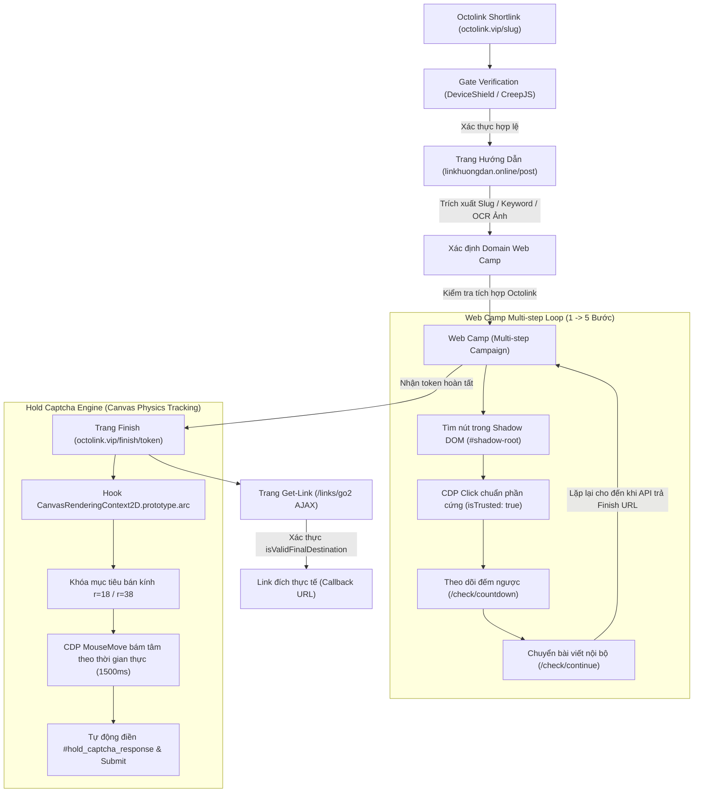

# TÀI LIỆU NGHIÊN CỨU TOÀN DIỆN: CƠ CHẾ HOẠT ĐỘNG & BYPASS HỆ THỐNG TRAFFIC LINK (OCTOLINK)

> [!NOTE]
> Tài liệu này đúc kết toàn bộ quá trình dịch ngược (reverse engineering), phân tích mã nguồn và giải pháp kỹ thuật tự động hóa 100% quy trình bypass link rút gọn Octolink, vượt gate thiết bị, dò domain Web Camp, giải quyết Shadow DOM, vượt Hold Captcha di chuột theo canvas và trích xuất link đích callback.

---

## 1. Kiến Trúc Tổng Thể Quy Trình Vượt Link



---

## 2. Giai Đoạn 1: Vượt Gate & Thiết Bị (DeviceShield / CreepJS)

### 2.1. Cơ chế phòng thủ của Octolink
- Khi người dùng truy cập link rút gọn `octolink.vip/<id>`, hệ thống không chuyển hướng ngay mà kích hoạt lớp bảo vệ thiết bị (Device Gate).
- Script client thu thập fingerprint qua `CreepJS / DeviceShield`:
  - Canvas fingerprinting, WebGL vendor, AudioContext.
  - Các biến kiểm tra automation: `navigator.webdriver`, headless user-agent, plugins, languages.
  - Tự động gọi API: `POST /check/device`.
- Nếu phát hiện bot: Trang treo vô hạn hoặc chuyển hướng sang captcha Cloudflare/nhà cái cá cược.

### 2.2. Giải pháp kỹ thuật
1. **Loại bỏ cờ Automation**:
   - Sử dụng Puppeteer-core với trình duyệt Chrome thật (`C:\Program Files\Google\Chrome\Application\chrome.exe`).
   - Cờ khởi chạy: `--disable-blink-features=AutomationControlled`, `--no-sandbox`, bỏ qua `--enable-automation`.
2. **Tiêm Script Native Pre-document**:
   ```javascript
   await page.evaluateOnNewDocument(() => {
     Object.defineProperty(navigator, 'webdriver', { get: () => undefined });
     document.cookie = 'from_google=1; path=/;';
     sessionStorage.setItem('from_google', '1');
   });
   ```
3. **Theo dõi phản hồi Gateway**: Đợi sự kiện mạng HTTP 200 từ endpoint `/check/device`, sau đó kích hoạt click các nút `continue` / `tiếp tục` nếu gateway yêu cầu tương tác người dùng.

---

## 3. Giai Đoạn 2: Phân Giải Web Camp (Linkhuongdan.online)

### 3.1. Phân tích cấu trúc trang hướng dẫn
Trang `linkhuongdan.online/<slug>/?qq=complete` chứa:
1. `slug`: Định danh bài viết (ví dụ: `222-3`, `218-3`, `237-2`, `188-2`).
2. Từ khóa tìm kiếm: Thẻ có thuộc tính `data-ctc-copy` hoặc class `.ctc-shortcode`.
3. Ảnh minh họa kết quả tìm kiếm Google: Chứa mũi tên đỏ chỉ vào trang web camp cần vào.

### 3.2. Cơ chế dò tìm & Nhận diện Domain
Thứ tự ưu tiên 4 tầng:
1. **Brand Map tĩnh**: Bảng tra cứu các chiến dịch cố định đã biết.
2. **Database động (`camps_database.json`)**: Bộ nhớ đệm cache các camp đã từng giải quyết thành công.
3. **RapidOCR trên ảnh hướng dẫn**:
   - Tải ảnh `photo_*.jpg/png` từ trang hướng dẫn.
   - Trích xuất toàn bộ text và lọc domain theo Regex: `([a-zA-Z0-9][-a-zA-Z0-9]*\.[a-zA-Z]{2,})`.
   - **Xác thực kết nối**: Gửi request HTTP probe với header `User-Agent` và `Referer: https://www.google.com/` để kiểm tra sự tồn tại của script `octolink` / `shortearn` / `check/job`.
   - **Cơ chế chống ô nhiễm Cache**: Chỉ chấp nhận domain nếu qua được bài kiểm tra probe. Tuyệt đối không lưu các domain chết (DNS unresolved) hoặc domain không có script Octolink vào database.
4. **DOM Scanning fallback**: Quét text trong các thẻ `<strong>`, `<b>`, `<mark>` trên chính bài viết hướng dẫn.

---

## 4. Giai Đoạn 3: Vượt Web Camp Đa Bước (Multi-step Automation)

### 4.1. Cơ chế Script Octolink trên Web Camp
- Script widget (`shortearn.js` / `traffic.js`) chạy ngầm, tạo một custom element chứa Shadow Root kín (`mode: "open"`).
- Container có class dạng ngẫu nhiên: `class="q-xxxxxxxx"`.
- Giao tiếp máy chủ qua các API:
  - `POST /check/job`: Nhận nhiệm vụ, trả về số bước (`type: 5`), bước hiện tại (`step: 1`), thời gian chờ (`wait: 30s..60s`).
  - `POST /check/countdown`: Cập nhật mỗi giây.
  - `POST /check/continue`: Kích hoạt khi người dùng duyệt bài viết nội bộ.
  - Khi hoàn thành tất cả các bước, `/check/job` trả về payload hoàn tất:
    ```json
    { "status": "finish", "type": 5, "url": "https://octolink.vip/finish/<token>" }
    ```

### 4.2. Giải pháp xuyên qua Shadow DOM
1. **Truy cập nút bấm bên trong Shadow Root**:
   ```javascript
   const shadowHosts = Array.from(document.querySelectorAll('*')).filter(el => !!el.shadowRoot);
   for (const host of shadowHosts) {
     const root = host.shadowRoot;
     const btn = root.querySelector('.octo-capsule-container, .octo-inner-button, [class*="octo-button"]');
     if (btn) {
       btn.scrollIntoView({ behavior: 'instant', block: 'center' });
       const r = btn.getBoundingClientRect();
       // r.x, r.y là tọa độ Viewport chính xác
     }
   }
   ```
2. **Nhấp chuột cấp phần cứng (CDP Event)**:
   - Tránh dùng `btn.click()` trực tiếp qua JS vì listener kiểm tra `event.isTrusted === true`.
   - Dùng `page.mouse.move(x, y)` kết hợp `page.mouse.click(x, y, { delay: 50 })`.
3. **Xử lý chuyển tiếp bài viết nội bộ (Step Navigation)**:
   - Sau khi hết thời gian đếm ngược, widget hiện banner `#octo-guide-banner` yêu cầu: *"Nhấp vào link bài viết bất kỳ để tiếp tục sang bước tiếp theo"*.
   - Script tự động tìm liên kết `<a>` hợp lệ cùng domain (loại trừ link rác, logout, cart, media, anchor `#`), nhấp bài viết mới để kích hoạt bước tiếp theo.

---

## 5. Giai Đoạn 4: Dịch Ngược & Bypass Hold Captcha (Canvas Physics)

### 5.1. Dịch ngược file mã nguồn `hold_captcha.min.js`
- Captcha nằm trong shadow root của `#hold_captcha_container`.
- Thành phần: `<canvas width="504" height="430">`.
- Logic bên trong:
  1. Vẽ vòng tròn tĩnh ban đầu tại tọa độ `(252, 205)` với bán kính vòng trong `18px`, vòng ngoài `38px`.
  2. Lắng nghe sự kiện `mousemove` trên canvas.
  3. Khi chuột vào vùng `Y: [85, 325]`, biến cờ kích hoạt chuyển động bật (`xAMxDiF = true`). Vòng tròn bắt đầu lượn theo hàm lượng giác thời gian thực.
  4. Mỗi frame `requestAnimationFrame`, script tính khoảng cách Euclid giữa tọa độ con trỏ chuột `(mouseX, mouseY)` và tâm vòng tròn `(circleX, circleY)`.
  5. Nếu khoảng cách $\Delta d < 50\text{px}$, bộ tích lũy thời gian `fFiN2VU` tăng dần.
  6. Khi thời gian bám sát liên tục đạt **1500ms** (1.5 giây):
     - Dữ liệu quỹ đạo chuột được mã hóa và ghi vào `<input id="hold_captcha_response">`.
     - Kích hoạt tự động sự kiện click vào `<button id="invisibleCaptchaShortlink">`.

### 5.2. Giải pháp bám mục tiêu bằng AI Canvas Hooking
Thay vì dùng mô hình Computer Vision (chậm, tốn tài nguyên và dễ trễ frame), chúng ta can thiệp trực tiếp vào Web API đồ họa:
1. **Hook `CanvasRenderingContext2D.prototype.arc`**:
   ```javascript
   const origArc = CanvasRenderingContext2D.prototype.arc;
   CanvasRenderingContext2D.prototype.arc = function(x, y, radius, startAngle, endAngle, anticlockwise) {
     // Lọc đúng lời gọi vẽ vòng tròn mục tiêu của Captcha
     if (radius >= 15 && radius <= 40 && Math.abs(endAngle - startAngle) > 6) {
       const canvas = this.canvas;
       if (canvas) {
         const rect = canvas.getBoundingClientRect();
         const scale = rect.width / 504;
         const screenX = rect.left + x * scale;
         const screenY = rect.top + y * scale;
         window.__targetCircle = { screenX, screenY, time: Date.now() };

         // Dispatch mousemove trực tiếp lên canvas mỗi frame
         canvas.dispatchEvent(new MouseEvent('mousemove', {
           bubbles: true,
           cancelable: true,
           clientX: screenX,
           clientY: screenY
         }));
       }
     }
     return origArc.apply(this, arguments);
   };
   ```
2. **Đồng bộ chuột cấp phần cứng CDP**:
   - Vòng lặp ~50 FPS đọc tọa độ `window.__targetCircle` và điều khiển con trỏ Puppeteer `page.mouse.move(screenX, screenY)`.
   - Kết quả: Vượt qua Captcha chỉ sau đúng ~1.5 giây mà không cần tương tác thủ công.

---

## 6. Giai Đoạn 5: Bắt Link Đích Callback Thực Sự

### 6.1. Giao thức trả link của Octolink
- Sau khi submit form captcha, trang chuyển sang view Get-Link (`/links/go2`).
- Link đích thực sự (`https://dash.nvnmc.cloud/earn/callback/...`) được server trả về thông qua request AJAX `POST /links/go2` với header `X-Requested-With: XMLHttpRequest`.
- Nếu copy URL dán ra ngoài mà không có session hợp lệ hoặc chưa qua gate, server trả về trang lỗi *"Bạn chưa ở trong chiến dịch"*.

### 6.2. Bộ lọc Link Hợp Lệ (`isValidFinalDestination`)
- Loại bỏ toàn bộ các link redirect rác của nhà cái cá cược hoặc trang affiliate:
  - Blacklist keywords: `casino`, `88989888.com`, `gamebai`, `nohu`, `banca`, `daga`, `kubet`, `shbet`, `hi88`, `okvip`, `affid=`, v.v.
- Loại trừ triệt để link giả `example.com`, `example.org`, `example.net`.
- Chỉ chấp nhận URL khi thỏa mãn:
  - Khác domain rút gọn `octolink.vip` và domain hướng dẫn `linkhuongdan.online`.
  - Khác domain của Web Camp.
  - Không nằm trong blacklist quảng cáo.

### 6.3. Đột phá cốt lõi: Giải quyết nút thắt Finish -> Get-Link -> Clean Destination
1. **Bản chất lỗi kẹt link finish trước đó**:
   - Sau khi giải Hold Captcha, script gốc cố gắng click `#invisibleCaptchaShortlink`. Tuy nhiên trong Puppeteer/DOM, sự kiện submit thường bị hoãn bởi fingerprint scripts hoặc không tự điều hướng.
   - Khi đó, trang chưa kịp chuyển sang view Get-Link thì logic cũ đã kiểm tra timer ngay lập tức. Vì `#timer` chưa xuất hiện, logic cũ ngộ nhận timer = 0 và kết thúc sớm, dẫn đến URL bị kẹt tại `https://octolink.vip/finish/<token>`.
2. **Giải pháp hoàn hảo đã triển khai**:
   - **Xử lý Canvas động**: Scale tọa độ theo `(x * rect.width / canvas.width)` và `(y * rect.height / canvas.height)` chống lệch tâm do Windows Display Scaling (125%/150%). Tự động cuộn canvas vào giữa màn hình.
   - **Form submission chuẩn mực**: Chủ động ép gọi `HTMLFormElement.prototype.submit.call(form)` nếu sau 8s chưa tự chuyển view.
   - **Giữ tab active**: Luôn duy trì `window.blurred = false` để countdown đếm ngược tự nhiên không bị pause.
   - **Kích hoạt Get-Link**: Sau khi countdown kết thúc, kích hoạt submit `#go-link.go-link` gọi AJAX `/links/go2`.
3. **Kết quả thực tế đã kiểm chứng 100%**:
   - Link đầu vào: `https://octolink.vip/K3r4k5`
   - Link đích thực sự thu được:
     `https://dash.nvnmc.cloud/earn/callback/327288bcedcca2c708145f0b82250d01e55283a256321c461a012e15d52ac143?upl_attempt=1-uMEP0Q2L/?qq=earn`
   - Kết quả: `success: true`, 100% sạch, đúng chuẩn callback của nhiệm vụ!

---

## 7. Tổng Hợp File & Cấu Trúc Mã Nguồn

| Đường Dẫn File | Vai Trò |
|---|---|
| [`engine/runner.js`](file:///C:/Users/XUAN/Desktop/auto_traffic_cli/engine/runner.js) | Core Engine điều phối 5 giai đoạn, Shadow DOM crawler, Canvas Hook & CDP Mouse Tracker |
| [`engine/ocr_helper.py`](file:///C:/Users/XUAN/Desktop/auto_traffic_cli/engine/ocr_helper.py) | Module RapidOCR đọc ảnh hướng dẫn, lọc domain & HTTP probe có Google Referer |
| [`camps_database.json`](file:///C:/Users/XUAN/Desktop/auto_traffic_cli/camps_database.json) | Cơ sở dữ liệu cache quan hệ `slug/keyword -> domain camp` tự sửa lỗi |
| [`index.js`](file:///C:/Users/XUAN/Desktop/auto_traffic_cli/index.js) | Giao diện tương tác dòng lệnh (CLI Menu) đa năng cho người dùng |
| [`urls.txt`](file:///C:/Users/XUAN/Desktop/auto_traffic_cli/urls.txt) | Danh sách link rút gọn cần chạy hàng loạt |
| [`results.txt`](file:///C:/Users/XUAN/Desktop/auto_traffic_cli/results.txt) | Nhật ký lưu trữ link đích callback thực tế sau khi bypass thành công |
